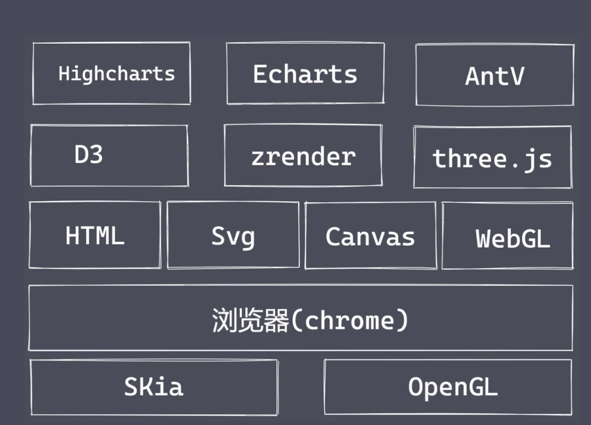
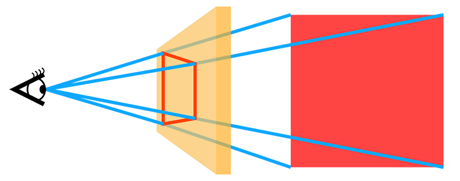
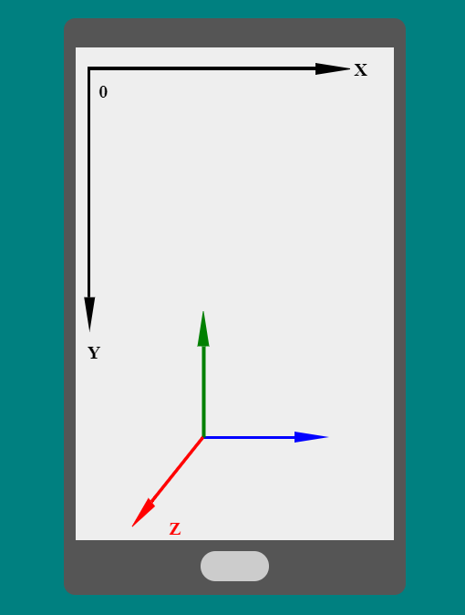
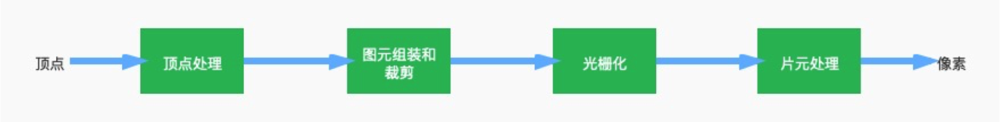
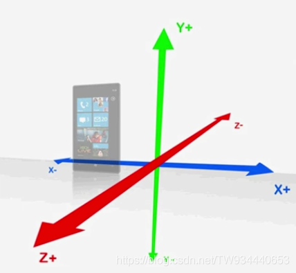
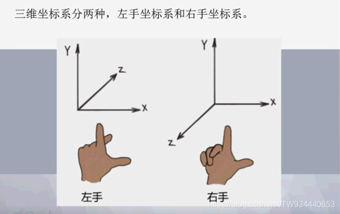

## 可视化解决方案

**Skia**是一个用C++开发的开源的2D渲染引擎，支持多个硬件和软件平台。而且他是Google chrome, android, Flutter产品里面用到的图形引擎。背后的标准也是OpenGL, 其他2D引擎还有cairo、nanovg等
**OpenGL **实现操作图形、图像的一套标准规范
 1. OpenGL ES是OpenGL 三维图形 API 的子集，针对手机、PDA和游戏主机等嵌入式设备而设计
  2. WebGL的技术规范继承自OpenGL ES
## Canvas 2D
## Svg
## HTML + CSS 3D动画
### transform

- 对元素进行变换(2d/3d)
- 旋转 rotate
- 缩放scale
- 平移translate
- 等等
### perspective

- 定义我们眼睛看到的3d立体效果，即空间感
- 距离屏幕的距离
- 图示


### css3坐标系

- 以手机屏幕为例，坐标系圆点位于屏幕最左上角；x轴水平，向右为正方向；y轴垂直，向下为正方向；z轴垂直于整个屏幕平面，向外为正方向，就是屏幕光线射向你眼睛的方向；
- 图示


### animation

-  设置一个动画 
-  animation-name 
   - keyframe 名称
-  animation-duration 
   - 动画所花费的时间
-  animation-timing-function 
   - 规定动画的速度曲线
-  animation-delay 
   - 规定在动画开始之前的延迟
-  animation-iteration-count 
   - 播放的次数
-  animation-direction 
   - 是否应该反向轮播

### 硬件加速

- 利用GPU来加速页面渲染

### 实践demo

- 实现一个旋转的立方体
```html
<!DOCTYPE html>
<html>
<head>
    <title>CSS3绘制一个立方体</title>
    <style>
        *{
            margin: 0;
            padding: 0;
        }
		
        .parent{
            position: relative;
            height: 400px;
            width:80%;
            margin-left: 10%;
            transform-style: preserve-3d;  /* 设置元素的子元素是位于 3D 空间中还是平面中 */
            animation: test1 8s ease infinite; /* 设置一个动画 */
        }
		@keyframes test1 {
            0%{
                transform: rotateX(0deg) rotateY(0deg) rotateZ(0deg);
            }
            100%{
                transform: rotateX(360deg) rotateY(360deg) rotateZ(360deg);
            }
        }
        .box{
            position: absolute;
            left: 50%;
            top: 50%;
            margin-top: -100px;
            margin-left: -100px;
            width:200px;
            height: 200px;
            color: #FFFFFF;
            font-size: 30px;
            font-weight: 700;
            line-height: 200px;
            text-align: center;
            opacity: 0.8;
        }
        .box1{
            background: #2b669a;
            transform: rotateY(90deg) translateZ(-100px);
        }
        .box2{
            background: #509a64;
            transform: rotateY(90deg) translateZ(100px);
        }
        .box3{
            background: #9a5468;
            transform: rotateX(90deg) translateZ(-100px);
        }
        .box4{
            background: #979a25;
            transform: rotateX(90deg) translateZ(100px);
        }
        .box5{
            background: #97709a;
            transform: translateZ(-100px);
        }
        .box6{
            background: #589a25;
            transform: translateZ(100px);
        }
       
    </style>
</head>
<body>
<div class="parent animation" id="css3d">
    <div class="box box1">1</div>
    <div class="box box2">2</div>
    <div class="box box3">3</div>
    <div class="box box4">4</div>
    <div class="box box5">5</div>
    <div class="box box6">6</div>
</div>
</body>
</html>
```
## WebGL
### 概述

-  WebGL 
   - 是一个JavaScript API，可在任何兼容的Web浏览器中渲染高性能的交互式3D和2D图形，而无需使用插件。
   - 通过WebGL API可以把一个三维场景绘制渲染出来
-  Canvas 
   -  WebGL依赖于Canvas元素实现。 
   -  canvas.getContext('webgl') 
      - 获取webgl上下文
-  OpenGL 
   - 实现操作图形、图像的一套标准规范
   - WebGL的技术规范继承自OpenGL ES
   - OpenGL ES是OpenGL 三维图形 API 的子集，针对手机、PDA和游戏主机等嵌入式设备而设计
-  着色器 
   -  WebGL实现图像渲染的一种绘图机制 
   -  着色器语言GLSL ES 
      - 用于计算机图形编程
      - 运行在GPU中
   -  顶点着色器 
      -  定义了顶点的渲染位置和点的渲染像素大小 
         - 提供裁剪空间坐标值
   -  片元着色器 
      -  定义了点的渲染结果像素的颜色值 
         - 提供颜色值
-  图元装配 
   - 将顶点组合成一个个单元，如点，线，三角形。
   - 将视口以外的对象进行裁剪
   - 得到图元
-  光栅化 
   -  将几何图元转化为图像的过程 
   -  图元数据转化成类似像素的东西 
   -  得到片元 
      - 一个像素大小的基本单位
      - 像素的前身
      - RGBA 之外，还会包含如深度值，法线，纹理坐标等信息
-  渲染管线 
   - 渲染管线流程图
- 
-  WebGL坐标系 (右手坐标系)
   -  图示 
   - 
   - 
   -  投影 
      - 显示器上显示的是平面像素
      - 我们看到的3D图形实际是几何体的投影

### WebGL API

-  着色器对象创建 gl.createShader 
   - gl.createShader(gl.VERTEX_SHADER) 顶点
   - gl.createShader(gl.FRAGMENT_SHADER) 片元
-  在着色器对象引入代码 gl.shaderSource 
   - 参数(着色器对象,着色器代码)
-  编译着色器 gl.compileShader 
   - 参数是着色器对象
-  创建程序对象 gl.createProgram 
-  在Program加上着色器 gl.attachShader 
   - 参数(program,着色器对象)
-  gl.linkProgram 
   - 链接program
-  gl.useProgram 
   - 使用program
-  绘制图形 gl.drawArrays() 
   - 通知GPU执行着色器代码，然后根据代码在Canvas画布上进行渲染绘制。
   - 参数(绘制模式mode,从第几个点画,画几个点)
- 等等

### WebGL实践demo

- WebGL绘制一个矩形
```html

<!DOCTYPE html>
<html lang="en">
<head>
    <meta charset="UTF-8">
    <title>WebGL绘制一个矩形</title>
</head>
<body>
<!--canvas标签创建一个宽高均为500像素，背景为蓝色的矩形画布-->
<canvas id="webgl" width="500" height="500" style="background-color:#0d72da"></canvas>

</body>
<!-- 顶点着色器源码 -->
<script id="vertexShader" type="x-shader/x-vertex">
  //attribute声明vec4类型变量apos
  attribute vec4 apos;
  void main() {
    //顶点坐标apos赋值给内置变量gl_Position
    //逐顶点处理数据
    gl_Position = apos;
  }

</script>
<!-- 片元着色器源码 -->
<script id="fragmentShader" type="x-shader/x-fragment">

  void main() {
    // 逐片元处理数据，所有片元(像素)设置为红色
    gl_FragColor = vec4(1.0,0.0,0.0,1.0);
  }

</script>

<script>
    //通过getElementById()方法获取canvas画布
    var canvas=document.getElementById('webgl');
    //通过方法getContext()获取WebGL上下文
    var gl=canvas.getContext('webgl');

    //顶点着色器源码
    var vertexShaderSource = document.getElementById( 'vertexShader' ).innerText;

    //片元着色器源码
    var fragShaderSource = document.getElementById( 'fragmentShader' ).innerText;

    //初始化着色器
    var program = initShader(gl,vertexShaderSource,fragShaderSource);
    //获取顶点着色器的位置变量apos，即aposLocation指向apos变量。
    var aposLocation = gl.getAttribLocation(program,'apos');

    //类型数组构造函数Float32Array创建顶点数组 上右 上左 下左 下左
    var data=new Float32Array([0.5,0.5,-0.5,0.5,-0.5,-0.5,0.5,-0.5]);

    //创建缓冲区对象
    var buffer=gl.createBuffer();
    //绑定缓冲区对象,激活buffer
    gl.bindBuffer(gl.ARRAY_BUFFER,buffer);
    //顶点数组data数据传入缓冲区
    gl.bufferData(gl.ARRAY_BUFFER,data,gl.STATIC_DRAW);
    //缓冲区中的数据按照一定的规律传递给位置变量apos
    gl.vertexAttribPointer(aposLocation,2,gl.FLOAT,false,0,0);
    //允许数据传递
    gl.enableVertexAttribArray(aposLocation);

    //开始绘制图形 (绘制模式mode,从第几个点画,画几个点)
    gl.drawArrays(gl.LINE_LOOP,0,4);

    // 声明初始化着色器函数  完成着色器代码的编译，然后在GPU上执行。
    // 主要是把顶点着色器代码， 片元着色器代码，进行编译处理，然后顶点着色器代码在GPU的顶点着色器单元执行，片元着色器代码在GPU的片元着色器单元执行, 片元着色器代码在GPU的片元着色器单元执行。
    function initShader(gl,vertexShaderSource,fragmentShaderSource){
         //创建顶点着色器对象
         var vertexShader = gl.createShader(gl.VERTEX_SHADER);
          //创建片元着色器对象
          var fragmentShader = gl.createShader(gl.FRAGMENT_SHADER);
          //引入顶点、片元着色器源代码
          gl.shaderSource(vertexShader,vertexShaderSource);
          gl.shaderSource(fragmentShader,fragmentShaderSource);
          //编译顶点、片元着色器
          gl.compileShader(vertexShader);
          gl.compileShader(fragmentShader);
  
          //创建程序对象program
          var program = gl.createProgram();
          //附着顶点着色器和片元着色器到program
          gl.attachShader(program,vertexShader);
          gl.attachShader(program,fragmentShader);
          //链接program
          gl.linkProgram(program);
          //使用program
          gl.useProgram(program);
          //返回程序program对象
          return program;
    }
</script>
</html>
```

-  实现一个旋转的立方体 
   - 提供立方体线框所有顶点的三维坐标
   - 通过旋转矩阵对所有顶点进行旋转变换
   - 调用绘制函数gl.drawArrays把所有点连成线渲染出来
### 缺陷

-  开发和学习门槛高 
   - 线性代数/计算机图形学
   - 场景的光照，纹理等的设计的理解
-  WebGL发展相当缓慢 
   -  支持的OpenGL标准太落后 
      -  最新的WebGL2.0对应的是OpenGL ES3.0的版本（2010) 
         - 很多现代GPU的强悍能力无法得到发挥
      -  OpenGL有着非常重的历史包袱 
         - 所有的状态都是全局的
         - 在OpenGL2.0时代之前，GPU可编程能力很小
   -  苹果仅支持OpenGL4.1 和OpenGL ES3.0，并且不支持计算Shader 
      - 在Metal之上实现WebGL需要花费大量的工作
      - Metal通过使用相关的 api 可以直接操作 GPU
      - Metal 是 iOS 平台独有的，意味着它不能像 OpenGL ES 那样支持跨平台
### 框架

-  Three.js 
   -  概述 
      -  WebGL 的综合库 
      -  场景 
         - 展示物体的一个空间
      -  相机 
         -  实际空间里的物体变成照片 
         -  眼睛 
         -  浏览器呈现的内容 
         -  正投影相机 
            - 远处近处的内容做同等大小呈现处理
         -  透视相机 
            - 符合心理习惯, 近大远小
      -  渲染器 
         - 把照片渲染成程序能展示的
         - 决定了内容如何呈现到屏幕
      -  几何体 
         - 屏幕中展示的实物
   - 渲染过程
   - 
   -  实践demo 
      - 实现一个旋转的立方体
```html
<!DOCTYPE html>
<html lang="en">
<head>
	<meta charset="UTF-8">
	<meta http-equiv="X-UA-Compatible" content="IE=edge">
	<meta name="viewport" content="width=device-width, initial-scale=1.0">
	<title>threejs 绘制立方体</title>
</head>
<body>
	<script src="https://threejs.org/build/three.js"></script>
	<!-- 
		1. 场景
		2. 相机: 分类 位置
		3. 渲染器: 大小 颜色
		4. 几何体: 立方体
	-->
	<script>
		// 场景
		const scene = new THREE.Scene()

		// 透视摄像机
		// 第一个参数是视野角度（FOV）: 显示器上看到的场景的范围，它的单位是角度
		// 第二个参数是长宽比（aspect ratio）: 一个物体的宽除以它的高的值	
		// 最后两个参数: 近截面（near）和远截面（far）,单位: 米
		const camera = new THREE.PerspectiveCamera(45, window.innerWidth / window.innerHeight, 1, 1000)

		// 渲染器
		const renderer = new THREE.WebGLRenderer({
			antialias: true // 抗锯齿
		});

		// 设置渲染器的宽高
		renderer.setSize( window.innerWidth, window.innerHeight );
        
		// 挂载到页面上 canvas
		document.body.appendChild(renderer.domElement)

		// 创建一个立方体 
		// width — X轴上面的宽度，默认值为1。
		// height — Y轴上面的高度，默认值为1。
		// depth — Z轴上面的深度，默认值为1。
		const geometry = new THREE.BoxGeometry(1, 1, 1);

		// 材质
		const material = new THREE.MeshBasicMaterial( { 
			color: 0x00ff00,
			wireframe: true // 线条
		});
		
		// 网格
		const cube = new THREE.Mesh( geometry, material );

		// 加到场景中
		scene.add(cube)
        
		// 把眼睛的Z轴放到5
		camera.position.z = 5;


		//渲染场景、
		animate();

		function animate() {
			// 使立方体旋转起来 角度
			cube.rotation.x += 0.01;
			cube.rotation.y += 0.01;
			requestAnimationFrame( animate );
			renderer.render( scene, camera );
		}
	</script>
</body>
</html>
```

-  Babylon.js 
   - 国外应用较广泛的 WebGL 库
-  Cesium.js 
   - 专用于 3D 地图开发的 WebGL 库
## WebGPU
### 为Web平台设计的全新一代，暴露GPU硬件底层能力的API
### 存在的意义

- WebGL太过落后
### 优势

- 减少CPU的开销
- 多线程的支持
### 发展现状

- WebGPU的API不稳定并且一直在发展中
### 框架

- Babylon.js 计算在5.0版本支持WebGPU
- Three.js 已经开始实现WebGPU的后端渲染器
## 应用

### 3D 网页游戏

### 房产

- VR全景看房

### 医学

- 描述解剖对象和健康状况

### 电子商务

- 商品展示

### 汽车

- 3D汽车模型展示

### 地图

参考链接:
WebGL
[https://developer.mozilla.org/zh-CN/docs/Web/API/WebGL_API](https://developer.mozilla.org/zh-CN/docs/Web/API/WebGL_API)
[https://juejin.cn/post/6994940475459731463](https://juejin.cn/post/6994940475459731463)
[https://juejin.cn/post/6966584226758000648#heading-12](https://juejin.cn/post/6966584226758000648#heading-12)
[https://book.douban.com/subject/26349497/](https://book.douban.com/subject/26349497/)
[https://juejin.cn/book/6844733755580481543?scrollMenuIndex=1](https://juejin.cn/book/6844733755580481543?scrollMenuIndex=1)
[https://juejin.cn/post/6844903482542014478](https://juejin.cn/post/6844903482542014478)
[https://caniuse.com/?search=WebGL](https://caniuse.com/?search=WebGL)
OpenGL教程: [https://learnopengl-cn.github.io/](https://learnopengl-cn.github.io/)
webGL学习资料:
[http://www.webgl3d.cn/WebGL/](http://www.webgl3d.cn/WebGL/)
[https://book.douban.com/subject/25909351/](https://book.douban.com/subject/25909351/)
[https://book.douban.com/subject/26349497/](https://book.douban.com/subject/26349497/)
[https://juejin.cn/book/6844733755580481543?scrollMenuIndex=1](https://juejin.cn/book/6844733755580481543?scrollMenuIndex=1)

threejs中文文档: [https://threejs.org/docs/index.html#manual/zh/introduction/Creating-a-scene](https://threejs.org/docs/index.html#manual/zh/introduction/Creating-a-scene)
应用:
游戏: [http://www.heyzxz.me/pcol/](http://www.heyzxz.me/pcol/)
汽车: [https://pano.autohome.com.cn/car/ext/49435#pvareaid=2023606](https://pano.autohome.com.cn/car/ext/49435#pvareaid=2023606)
房产: [https://realsee.com/ke/jGKlDrljnNyM1XJA/Kbjn1w8XpZzSDhyhDTMZwyahb87DlkaB/#lianjia](https://realsee.com/ke/jGKlDrljnNyM1XJA/Kbjn1w8XpZzSDhyhDTMZwyahb87DlkaB/#lianjia)
医学: [https://developer.biodigital.com/](https://developer.biodigital.com/)
电子商务: [https://www.threekit.com/3d-product-library/engagement-ring?hsLang=en](https://www.threekit.com/3d-product-library/engagement-ring?hsLang=en)
地图:[https://www.google.com/maps/@31.2404012,121.4908964,3a,75y,307.47h,102.83t/data=!3m7!1e1!3m5!1sAF1QipMnoCg_HHJm6p-62YjO-XIOV6kECSPwBO1rs6j2!2e10!3e12!7i10000!8i5000](https://www.google.com/maps/@31.2404012,121.4908964,3a,75y,307.47h,102.83t/data=!3m7!1e1!3m5!1sAF1QipMnoCg_HHJm6p-62YjO-XIOV6kECSPwBO1rs6j2!2e10!3e12!7i10000!8i5000)
WebGUP
[https://juejin.cn/post/7054752323259596814](https://juejin.cn/post/7054752323259596814)
[https://juejin.cn/column/7055115664071065637](https://juejin.cn/column/7055115664071065637)
[https://www.youtube.com/watch?v=y2dZYG5YTRU](https://www.youtube.com/watch?v=y2dZYG5YTRU)
