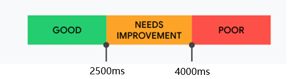
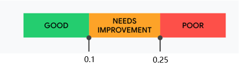
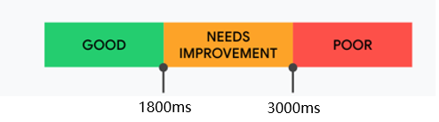
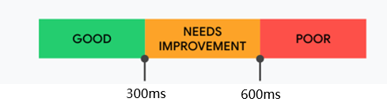

## 性能优化分析

### 分析URL输入到页面渲染的整个过程, 每一个点都有优化的可能


### 分析工具

- chrome Performance
- chrome memory
- chrome light house
- webpack  webpack-bundle-analyzer

[前端性能优化分析工具及优缺点](./前端性能优化分析工具及优缺点)

### 性能指标

- LCP（Largest Contentful Paint）

  - 页面的速度指标: 记录视窗内最大的元素绘制的时间
  - https://web.dev/lcp/
  - good 2.5sec, needs 4.0sec

  
- FID（First Input Delay）

  - 页面的交互体验指标: 用户第一次与页面交互(单击链接、点按按钮等)， 到浏览器对交互作出响应的耗时
  - https://web.dev/fid/
  - good 100ms, needs 300ms

  
- CLS （Cumulative Layout Shift） 

  - 页面的稳定指标: 记录了页面上非预期的位移波动
  - https://web.dev/cls/
  - good:  0.1, needs: 0.25

  
- FP（First Paint） & FCP（First Contentful Paint）

  - FP

  	- 记录页面第一次绘制像素的时间
  	- 白屏时间
  - FCP

    - 从开始加载到页面内容(文本、图像、svg、非白色canvas)的任何部分在屏幕上完成渲染的时间
    - https://web.dev/fcp/
    - good: 1.8sec

    
  - FP <= FCP
- TTFB Time to First Byte 

	- 浏览器请求资源到响应第一个字节回来的时间
  - good: 300ms

  

- TTI （Time to Interactive）

	- 首次可交互时间
	- 从 FCP 指标后开始计算
	-  持续 5 秒内无长任务（执行时间超过 50 ms）且无两个以上正在进行中的 GET 请求
	- 往前回溯至 5 秒前的最后一个长任务结束的时间
- TBT （Total Blocking Time）

	- 阻塞总时间,  记录在 FCP 到 TTI 之间所有长任务的阻塞时间总和
- SI (Speed Index)

	- 首屏展现平均值
	- good: 3.4 sec, needs: 5.8 sec
- 常规

	- fps是看流畅度的
	- cpu看运行状态
	- 火焰图

		- good: vvvvvv
		- 差: |_|_|___|___| 
		- 关注其红三角

### 性能指标采集方法

一般使用专业的监控工具采集，以下列举的是典型指标的获取和常用的采集工具

#### FCP

First Contentful Paint 是指 从开始加载到页面内容(文本、图像、svg、非白色canvas)的任何部分在屏幕上完成渲染的时间

这个指标可以衡量网站脱离白屏的时间， **也可以反应浏览器渲染的性能情况**

```js
new PerformanceObserver((entryList) => {
  for (const entry of entryList.getEntriesByName('first-contentful-paint')) {
    console.log('FCP candidate:', entry.startTime, entry);
  }
}).observe({type: 'paint', buffered: true});
```


#### LCP

largest-contentful-paint是指`页面加载开始到最大文本块或图像元素在屏幕上完成渲染的时间`
这个指标可以反应页面整体已经完成渲染， **反应浏览器渲染的性能情况**

```js
new PerformanceObserver((entryList) => {
  for (const entry of entryList.getEntries()) {
    console.log('LCP candidate:', entry.startTime, entry);
  }
}).observe({type: 'largest-contentful-paint', buffered: true});
```

#### TTFB

Time to First Byte 只指 `浏览器请求资源到响应第一个字节回来的时间`

这个指标可以很大程度上**ssr项目中， 服务器部分的性能**， 在普通spa的页面， 意义不大

```js
const time = performance.timing
console.log(time.responseStart - time.requestStart)
```


#### 工具

* Web Vitals
* (在线测试网站)[https://developers.google.com/speed/pagespeed/insights]